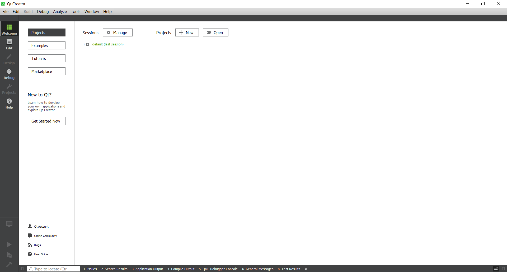
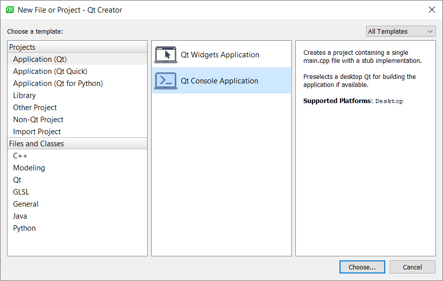
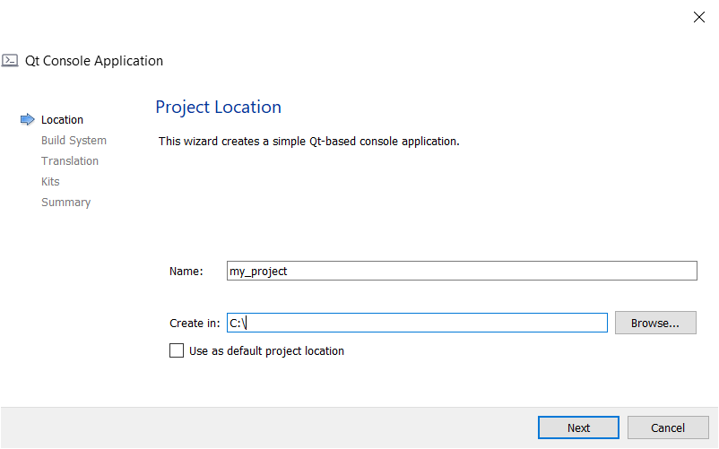
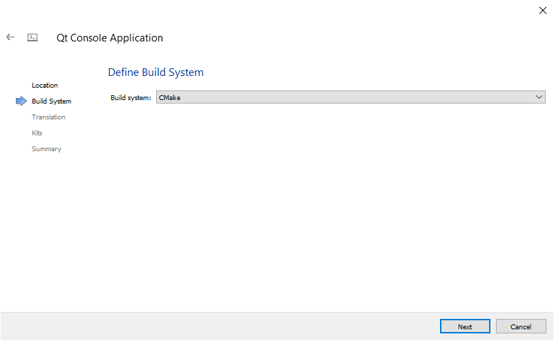
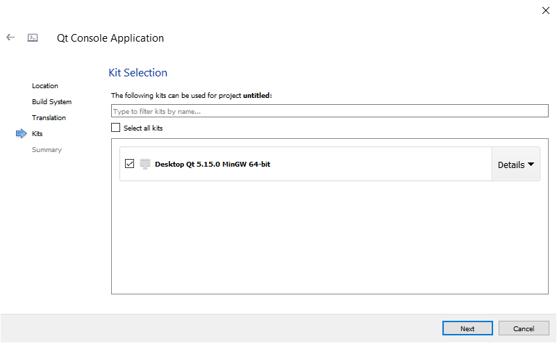
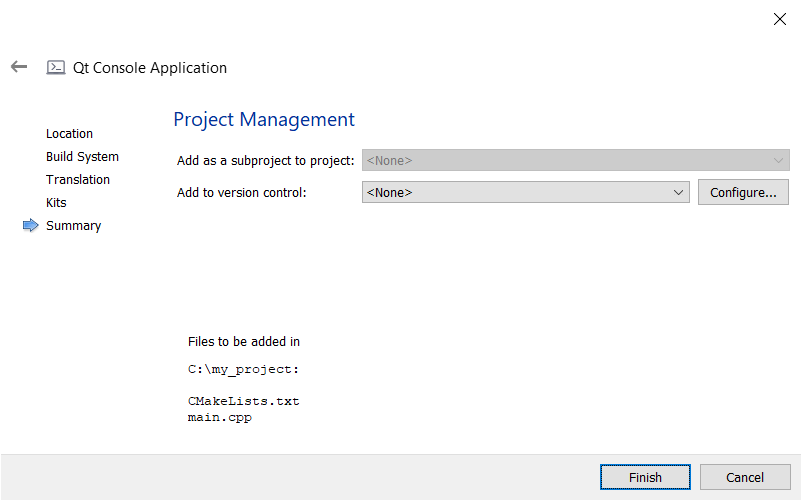
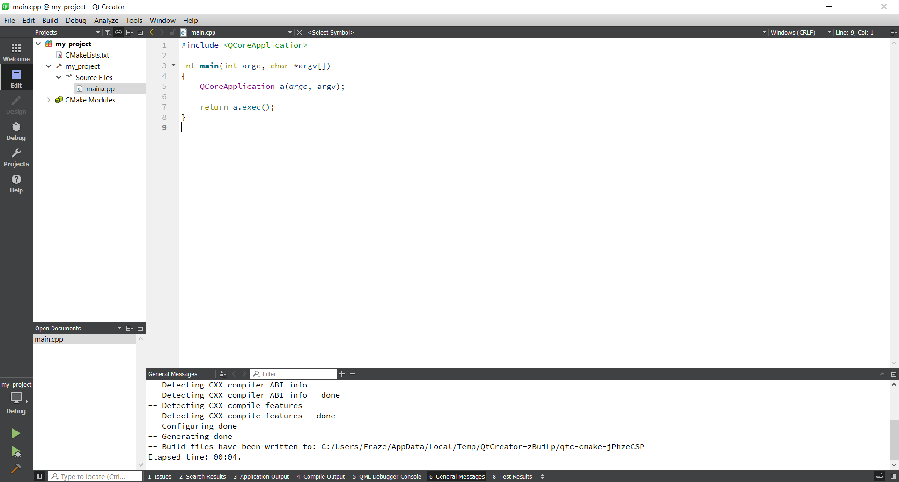

# Creating a new C++ project in Qt Creator

 In this README.md, I show you how to create a new C++ project in Qt Creator.

 # Steps

 Follow the below steps to create a new C++ project.

 ## Step 1

 Open Qt Creator. When done, you should see the following window:

 

 ## Step 2

Left click on the "File" menu. Left click on the "New File or Project...", 

When done, you should see the following window:

## Step 3

Left click on "Qt Console Appliation". Left click on the "Choose..." button.

When done, you should see the following window:

Change the "Name:" text box to what you want your project to be called. Here, I've called it "my_project".

Change the "Create In:" text box to a directory where you want your project to be saved. Here, I've saved it in "C:\".

## Step 4

Left click on the "Next" button. 

When done, you should see the following window:

Change the "Build System" drop-down menu to the build system you want to use. Here, I've used CMake.

**Note:** To use CMake, you need to have CMake installed. You can download it from here: [https://cmake.org/](https://cmake.org/).

## Step 5

Left click on the "Next" button.

When done, you should see the following window:

Do not change anything.

## Step 6

left click on the "Next" button.

When done, you should see the following window:

Left click on a kit you want to use. Here, I've selected "Desktop Qt 5.15.0 MinGW 64-bit.

**Note:** When you install Qt, you need to select the kits you want to install. In this case, I installed the MinGW 64-bit kit.

## Step 7

left click on the "Next" button.

When done, you should see the following window:

Do not change anything.

## Step 8

Left click on the "Finish" button.

When done, you should see the following window:

# Conclusion

If you've followed these steps correctly, you're now ready to write your C++ program.

# Credit

Dr Frazer K. Noble  
Massey University  
Auckland  
New Zealand  