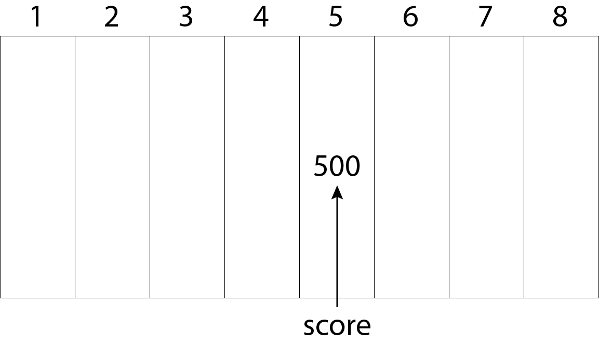

## Lecture 3: Creating Variables and Constants

## What You'll Learn in this Lecture:

* How to create variables and constants
* How to assign values to variables and change those values
* How to display the value of variables
* How to find out how much memory a variable requires

## What is a Variable?

A variable is a location in computer memory where you can store and retrieve a value. Your computer's memory can be thought of as a series of boxes lined up in a long row. Each box is numbered sequentially. The number of each box is its memory address.

Variables have addresses and are given names that describe their purpose. In a game program, you could create a variable named `score` to hold a player's score. A variable is a label for a box so that it can be accessed without knowing the actual memory address.

### Figure 3.1 A visual representation of memory.
<p align="center">  
    <br>
</p>

## Storing Variables in Memory

When you create a variable in C++, you must tell the compiler the variable's name and what kind of information it will hold, such as an integer, e.g. 1, 2, or 3; a character, e.g. 'a', 'b', or 'c'; or a floating-point number, e.g. 1.0, 2.5, or -1.25. This is the variable's type (or referred to as data type). The type tells the compiler how much room to set aside in memory to hold the variable's value.

Each box in memory can hold one byte. If a variable's type is two bytes in size, it needs two bytes of memory. Because computers use bytes to represent values, it is important that you familiarise yourself with this concept.

A short integer (`short`) is usually two bytes. A long integer (`long`) is four bytes. An integer (`int`) can be two or four bytes. A `long long integer` is eight bytes.

A character of text (`char`) is usually one byte.

In Figure 3.1, each box holds one byte. A two-byte value such as a `short` could be store in address 1 and 2.

True or false values are Boolean values (`bool`). 

> **Note**
Boolean variables are named for George Boole, an English mathematician who lived from 1815 to 1864. He created Boolean algebra, a branch in which values are limited to either true or false. His creation forms the basis of modern computing all the way down to the smallest digital circuit.

The size of a `short` is always smaller than, or the same size as, an `int`. The size of an `int` is always smaller, or the same size as, a `long`.

The given types' sizes are always the same on every system. You can check the size a type holds in C++ using the `sizeof()` function. The parenthesis that follow `sizeof` should be filled with the name of a type as an argument. For example:

```C++
std::cout << sizeof(int) << std::endl;
```

This statement displays the number of bytes required to store an integer variable. The `sizeof()` function is provided by the compiler and does not require an include directive. Listing 3.1 provides an example of how it can be used to display sizes of common C++ types on your computer.

### Listing 3.1 The Full Text of listing3_1's `main.cpp`
```C++
#include <QCoreApplication>
#include <iostream>

int main(int argc, char *argv[])
{
    QCoreApplication a(argc, argv);

    std::cout << "The size of an integer: ";
    std::cout << sizeof(int) << " bytes." << std::endl;
    std::cout << "The size of an short integer: ";
    std::cout << sizeof(short) << " bytes." << std::endl;
    std::cout << "The size of an long integer: ";
    std::cout << sizeof(long) << " bytes." << std::endl;
    std::cout << "The size of an character: ";
    std::cout << sizeof(char) << " bytes." << std::endl;
    std::cout << "The size of an boolean: ";
    std::cout << sizeof(bool) << " bytes." << std::endl;
    std::cout << "The size of an float: ";
    std::cout << sizeof(float) << " bytes." << std::endl;
    std::cout << "The size of an double float: ";
    std::cout << sizeof(double) << " bytes." << std::endl;
    std::cout << "The size of an long long integer: ";
    std::cout << sizeof(long long int) << " bytes." << std::endl;

    return a.exec();
}
```

> **Note**
This program makes use of a relatively recent addition to the C++ language: the long long int data type, which holds extremely large integers. In your compiler fails with an error on Listing 3.1, you probably are using a compiler that is out-of-date and does not support C++11, the version prior to C++14. Delete lines 23-24 and try to compile the program again. If it works, that's the problem and you need to use a newer compiler.

After compiled, this program produces the following output when run on Windows 10:

```Console
The size of an integer: 4 bytes.
The size of an short integer: 2 bytes.
The size of an long integer: 4 bytes.
The size of an character: 1 bytes.
The size of an boolean: 1 bytes.
The size of an float: 4 bytes.
The size of an double float: 8 bytes.
The size of an long long integer: 8 bytes.
```

Compare this output to how it runs on your computer. The `sizeof()` function returns the size of the specified object as its argument.

## Signed and Unsigned Variables

All integer types come in two varieties specified using a keyword: unsigned, for when they hold positive numbers; or signed, for when they hold positive or negative numbers. For example:

```C++
unsigned int age = 34;
signed int difference = -1;
```

Here, the variable `age` is assigned the initial value of 34 and the variable difference is assigned the initial value of -1.

Integers that do not specify either `signed` or `unsigned` are assumed to be signed.

Signed and unsigned integers are stored using the same number of bytes. For this reason, the largest number that be stored in an unsigned integer is twice as big as the largest positive number that can be stored in a signed integer. An `unsigned short` can represent numbers from 0 to 65,535. Half the numbers represented by a `signed short` are negative, so it can represent numbers from -32,768 to 32,767. In both cases, the total number of possible values is 65,535.

## Variable Types

In addition to integer variables, C++ types include floating-point values and characters of text.

Floating point values have values that can be expressed as decimal values. Character variables hold a single byte representing 1 of the 256 characters and symbols in the standard ASCII character set.

Variable types supported by C++ programs are shown in Table 3.1, which lists the variable type, its common memory size, and the possible values that it can hold. Compare this table to the output of Listing 3.1's program.

### Table 3.1 Variable Types
| Type           | Size    | Values                              |
|----------------|---------|-------------------------------------|
| unsigned short | 2 bytes | 0 to 65,535                         |
| short          | 2 bytes | -32,768 to 32,767                   |
| unsigned long  | 4 bytes | 0 to 4,294,967,295                  |
| long           | 4 bytes | -2,147,483,648 to 2,147,483,647     |
| int            | 4 bytes | -2,147,483,648 to 2,147,483,647     |
| unsigned int   | 4 bytes | 0 to 4,294,967,297                  |
| long long int  | 8 bytes | -9.2 quintillion to 9.2 quintillion |
| char           | 1 byte  | 256 character values                |
| bool           | 1 byte  | true or false                       |
| float          | 4 bytes | 1.2e-38 to 3.4e38                   |
| double         | 8 bytes | 2.2e-308 to 1.8e308                 |

The short and long variables are also called `short int` and `long int` in C++. Both forms are acceptable in your programs.

As shown in Table 3.1, `unsigned short` integers can hold a value only up to 65,535, while signed short integers can hold half that at maximum. Although `unsigned long long int` integers can hold more than 18.4 quintillion, that's still finite. If you need a larger number, you must use `float` or `double` at the cost of some numeric precision. Floats and doubles can hold extremely large number, but only the first 7 or 19 digits are significant on most computers. Additional digits are rounded off.

## Defining a Variable

A variable is defined in C++ by stating its type, the variable's name, and then adding a semi-colon at the end of the statement. For example:

```C++
int highScore;
```

More than one variable can be defined in the same statement, as long as they share the same type. The names should be separated by a comma. For example:

```C++
unsigned int highScore, playerScore;
long area, width, length;
```

The `highScore` and `playerScore` variables are both unsigned integers. The second statement creates three `long` integers: `area`, `width`, and `length`. Because these integers share the same type, they can be created in one statement.

A variable name can be any combination of uppercase and lowercase letters (A-Z, a-z), numbers(0-9), and underscore characters (_), but not spaces ( ). Legal variable names include `hello`, `jumpHeight`, `dice8`, and `playerScore`. C++ is case sensitive, so the `highScore` variable differs from ones named `highscore` or `HIGHSCORE`.

Using descriptive variable names makes it easier to understand a program for the humans reading it. Consider the following:

```C++
int main()
{
    unsigned short x = 1;
    unsigned short y = 2;
    unsigned int z = 0;
    z = x * y;

    std::cout << z;

    return 0;
}
```

and

```C++
int main()
{
    unsigned short width = 1;
    unsigned short length = 2;
    unsigned short area = 0;
    area = width * length;

    std::cout << area;

    return 0;
}
```

Both programs achieve the same outcome; however, which one do you think was the easier to read?

Programmers differ in the conventions they adopt for variable names. Some prefer all lowercase letters for variable names with underscores separating words, e.g. `high_elves`, `player_score`, and `world_record. Others prefer lowercase letters except for the first letter of new words (CamelCase), e.g. `highElves`, `playerScore`, and `worldRecord`.

Programmers familiar with Linux tend to use the lowercase_with_underscores convention; whereas programmers familiar with Windows tend to use the CamelCase convention (or the lowerCamelCase/UpperCamelCase variants).

In this course, we'll use the CamelCase convention.

With well-chosen variable names and lots of comments, your C++ code will be much easier to read when you look back on it in the future.

> **Note**
Some compilers allow you to turn case sensitivity of variables names off. Do not do this. If you do, your programs won't work with other compilers.

Some words may not be used as variables in C++ because they are keywords used by the language. Reserved words include `if`, `while`, `for`, and `main`. Generally, any reasonable name for a variable is almost certainly not a keyword.

Variables may contain a keyword as part of its name, but not the entire name. Variables named `mainFlag`, `forward`, `iffy`, and `whiley` are permitted.

## Assigning Values to Variables

A variable is assigned a value using the = operator, which is called the assignment operator. For example:

```C++
unsigned int highScore;
highScore = 13000;
```

A variable can be assigned an initial value when it is created. For example:

```C++
unsigned int highScore = 13000;
```

This is called initialising the variable.

Listing 3.2 uses variables and assignments to compute the area of a rectangle and display the results.

### Listing 3.2 The Full Text of listing3_2's `main.cpp`
```C++
#include <QCoreApplication>
#include <iostream>

int main(int argc, char *argv[])
{
    QCoreApplication a(argc, argv);

    // set up width and length
    unsigned short width = 26, length;
    length = 40;

    // create an unsigned short initialised with the
    // result of multiplying width by length
    unsigned short area = width * length;

    std::cout << "Width: " << width << std::endl;
    std::cout << "Length: " << length << std::endl;
    std::cout << "Area: " << area << std::endl;

    return a.exec();
}
```

This program produces the following output when run:

```Console
Width: 26  
Length: 40  
Area: 1040
```

Similar to the other listings, Listing 3.2's program uses the `#include` preprocessor directive to bring the standard iostream library into the program. This makes it possible to use `std::cout` to display information.

Within the program's `main()` block, on line 6 the variables `width` and `length` are created and `width` is initialised with the value of 26. On line 7, length is assigned the value of 40 using the assignment operator (=).

On line 11, an integer named `area` is defined. This variable is initialised with the value of the variable `width` multiplied by the value of the variable `length`. The multiplication operator, * multiplies one number by another.

On lines 13-15, the values of all three variables are displayed.

## Using Type Definitions

When a C++ program contains a lot of variables, in can be repetitious to keep writing unsigned short int for each one. A shortcut for an existing type can be created using a type definition (`typedef`).

A `typedef` requires `typedef` followed by the existing type and its new name. For example:

```C++
typedef unsigned short USHORT
```

This statement creates a type definition named USHORT that can be used anywhere in a program in place of unsigned short. Listing 3.3 is like Listing 3.2, but uses the above type definition.

### Listing 3.3 The Full Text of listing3_3's `main.cpp`
```C++
#include <QCoreApplication>
#include <iostream>

int main(int argc, char *argv[])
{
    QCoreApplication a(argc, argv);

    // create a type definition
    typedef unsigned short USHORT;

    // set up width and length
    USHORT width = 26;
    USHORT length = 40;

    // create an unsigned short initialised with the
    // result of multiplying width by length
    USHORT area = width * length;

    std::cout << "Width: " << width << std::endl;
    std::cout << "Length: " << length << std::endl;
    std::cout << "Area: " << area << std::endl;

    return a.exec();
}
```

The program has the same output as Listing 3.2.

On line 6, the `USHORT` typedef is created as a shortcut for `unsigned short`. A type definition substitutes the underlying definition `unsigned short` wherever the shortcut `USHORT` is used.

> **Note**
Some compilers will warn that in Listing 3.3 program a "conversion may lose significant digits." This occurs because the product of two USHORTs on line 14 might be larger than an unsigned short integer can hold. For this program, you can safely ignore the warning.

## Constants

A constant, like a variable is a memory location where a value can be store. Unlike a variable, a constant never changes its value. You must initialise a constant when it is created. C++ has two types of constants: 1) literal, and 2) symbolic.

A literal constant is a value type directly into your program wherever it is needed. For example:

```C++
long width = 19;
```

This statement assigns the integer variable width with the value 19. The 19 in the statement is a literal constant. You can't assign a value to 19, and its value can't be changed.

The values `true` and `false`, which are stored as `bool` variables, are also literal variables.

A symbolic constant is a constant represented by a name, just like a variable. The const keyword precedes the type, name, and initialisation. For example:

```C++
const int KILL_BONUS = 5000;
```
Here's how you could use this constant:

```C++
int playerScore = 500;
playerScore = playerScore + KILL_BONUS;
```

If you later decide to change the const's value, the change would be reflected throughout your program. However, if you were to use the literal constant 5000, it may become difficult to find all the places you wrote 5000.

Well-named symbolic constants also make a program more understandable. Constants often are fully capitalised by programmers to make them distinct from variables.

## Defining Constants

An alternative way to defining constants is to use the #define preprocessor directive. It can create a constant by specifying its name and value, separated by spaces. For example:

```C++
#define KILL_BONUS 5000
```

The constant does not have a type such as int or char. The `#define` directive enables a simple text substitution that replaces every instance of `KILL_BONUS` in the code with 5000. The compiler only sees the result.

Because these types lack a type, the compiler cannot ensure that the constant has a proper value. Because these defined constants cannot be checked for type, it's better to use the standard constants and avoid using a directive to set a constant.

## Enumerated Constants

Enumerated constants create a set of constants with a single statement. They are defined with the keyword enum followed by a series of comma-separated names surrounded by braces. For example:

```C++
enum COLOR { RED, BLUE, GREEN, WHITE, BLACK };
```

This statement creates a set of enumerated constants named COLOR with five values named `RED`, `BLUE`, `GREEN`, `WHITE`, and `BLACK`. The set of constants is called an enumeration.

Internally, enumerated constants hold integer values. The values begin with 0 for the first constant in the set and counts up by 1. So, `RED` is 0, `BLUE` is 1, `GREEN` is 2, `WHITE` is 3, and `BLACK` is 4. All the values are integers.

Constants also can specify their values using an = assignment operator. For example:

```C++
enum COLOR {RED = 100, BLUE, GREEN = 102, WHITE, BLACK };
```

This statement sets `RED` to 100 and `GREEN` to 102. `BLUE` is 1 more than `RED`, i.e. 101, and `WHITE` and `BLACK` are 103 and 104.

The advantage of this technique is that you get to use a symbolic name, such as `BLACK` and `WHITE`, rather than a possibly meaningless number, such as 1 or 100.

Listing 3.4 uses enumerated constants for the eight compass directions, storing one in a variable named heading.

### Listing 3.4 The full text of listing3_4's `main.cpp`
```C++
#include <QCoreApplication>
#include <iostream>

int main(int argc, char *argv[])
{
    QCoreApplication a(argc, argv);

    // set up enumeration
    enum Direction  { North, Nortwest, East, Southeast, South, Southwest, West, Northwest };

    // create a variable to hold it
    Direction heading;
    // initalise that variable
    heading = Southeast;

    std::cout << "Moving " << heading << std::endl;

    return a.exec();
}
```

Compile and run the program to produce this output:

```Console
Moving 3
```

An enumeration is defined in lines 6-7. A variable is created to hold one of these eight enumerated constants and it is set to the value `Southeast`.

When this is displayed, the integer value of that constant is shown, not its name.

## Auto-typed Variables

A variable in C++ must have a type that indicates the kind of information it holds, such as `long` for a long integer. As a programmer, you determine the type at the variable's creation. For example:

```C++
int seconds = 30000;
```

The `auto` keyword in C++ enables a type to be inferred based on the value that's initially assigned to it. The compiler figures out a suitable data type. For example:

```C++
auto seconds = 30000;
auto minutes = 0.5F;
auto hours = 3.0 / 12;
```

These statements create a `seconds` variable that holds an `int` value, a `minutes` variable that holds a `float` value, and a `hours` variable that holds a `double` value. The literal assigned to the variable at initialisation determines the type.

In the hours statement, the expression 3.0 / 12 produces a `double` because one of the operands is a `double` value.

When using `auto`, you must assign the variable a value at initialisation. 

Multiple variables can be assigned with an `auto` keyword if every one of the variables has the same data type. For example:

```C++
auto a = 96, b = 97, c = 98;
```

Listing 3.5 illustrates the use of the `auto` keyword to compute a computer game's combat statistics.

### Listing 3.5 The Full Text of `listing_3_5.cpp`
```C++
#include <QCoreApplication>
#include <iostream>

int main(int argc, char *argv[])
{
    QCoreApplication a(argc, argv);

    //define character values
    auto strength = 80;
    auto accuracy = 45.5;
    auto dexterity = 24.0;

    // define constants
    const auto MAXIMUM = 50;

    // calculate character combat stats
    auto attack = strength * (accuracy / MAXIMUM);
    auto damage = strength * (dexterity / MAXIMUM);

    std::cout << "Attack rating: " << attack << std::endl;
    std::cout << "Damage rating: " << damage << std::endl;

    return a.exec();
}
```

Because the `auto` keyword was added in a recent C++ version, you may need to compile `listing_3_5.cpp` with a special command-line option. The -std=C++14 option causes the compiler to use a recent version of C++. For example:

```Console
g++ -std=c++14 listing_3_5.cpp -o listing_3_5.exe
```

After it's compiled successfully and run, the program displays the following output:

```Console
Attack rating: 72.8
Damage rating: 38.4
```

In lines 6-8, variables set the value of the attributes: the character's strength, accuracy, and dexterity. In lines 14-15, these are substituted in formulas to calculate an attack rating and damage rating.

All six variables in the program make use of the `auto` keyword. If lines 6-8 are initialised with integers, they are treated as `int` variables; if they are initialised with floating-point values, they are treated as `double` variables.

> **Note**
Older versions of C++ had an auto keyword that was supposed to be used to indicate that a variable was local to the part of the program it was defined in-a concept called scope. The developers of C++ inspected millions of lines of code and found only a handful of uses, most in test suites. They decided the keyword was redundant and replaced it with this new functionality.  Any code that relies on the old meaning of auto will not work in C++14.

## Summary

In this lecture, we covered how to work with simple data types in C++. Variables are used to store values that can change as a program runs. Constants store values that can't change as a program runs.

The biggest challenge when using variables is choosing the proper type. If you're working with signed integers that might go larger than 65,000, you should store them in a `long` rather than a `short`. If a number contains decimal values, it must be either a `float` or a `double`.

The `auto` keyword takes some of the work out of using variables: it makes the compiler determine the type.

One thing to remember when working with variables is the number of bytes they occupy, which can differ on different systems. The `sizeof()` function provided by the compiler returns the number of bytes any variable type requires.

## Q & A

Q. If a `short` integer can run out of room, why not always use `long` integers?

A. Both `short` and `long` integers will run out of room, but a `long` integer will do so with a much larger number. On most computers, a `long` integer takes up twice as much memory, which has become less of a concern because of the memory available on modern PCs.

Q. What happens if I assign a number with a decimal to an integer rather than a `float` or `double`? For example:

```C++
int rating = 5.4;
```

A. Some compilers issue a warning, but the assignment of a decimal value to an integer type is permitted in C++. The number is truncated into an integer, so the statement assigns the rating the integer value 5. The more precise information is lost in the assignment, so if you tried later to assign `rating` to a `float` variable, it would still equal 5.

Q. Why should I bother with symbolic constants?

A. When a constant is used in several places in a program, a symbolic constant enables all the values to change simply by changing the constant's initialisation. Symbolic constants also serve an explanatory purpose like comments. If a statement multiplies a number by 360, it's less easily understood than multiplying it by a constant named `degreesInACircle` that equals 360.

## Workshop

## Quiz

1. Why would you use unsigned over signed integers?

    A.  They hold more numbers.
    B.  They hold more positive numbers.
    C.  There's no reason to prefer one over the other.

<!-- B. Unsigned integers hold more positive values and cannot be used to hold negative values. They hold the same number of values.  -->

2. Are the variables ROSE, rose, and Rose the same?

    A.  Yes.
    B.  No.
    C.  Maybe. I don't know. What was the question?

<!-- B. Because C++ is case sensitive, a ROSE, is not a Rose, is not a rose. Each reference is treated as a different variable by the compiler. -->

3. What is difference between a #define constant and const?

    A. Only one is handled by the preprocessor.
    B. Only one has a type.  
    C. Both A. and B.

<!-- C. The preprocessor directive #define substitutes the specified value into your code every place it appears. It does not have a data type and is invisible to the compiler. A constant, created with the keyword const, has a data type and is handled by the compiler. -->

## Activities

1. Given the following constants: melee attack (6 damage), ranged attack (6 damage), and magic attack (10 damage), write a program that computes the combined damage of 2 melee attacks, 1 ranged attack, and 1 magic attack. The program should display the combined damage.

2. Write a program that computes the volume of a cube. The program should display the calculated volume.
